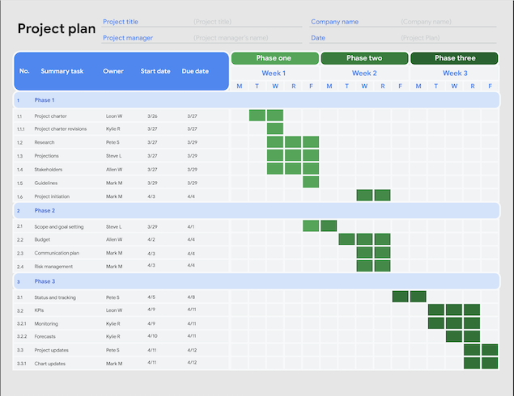

# Getting started with a project plan
- Useful for any project, big or small
- Documents tasks, milestones and overall activities
- At the center: schedule
  - Helps estimate the amount of time to complete the project
  - Way to track the project against the goals

## Components of a Project Plan
- Tasks
  - Activities that need to be acomplished in a given time
  - Assigned to members of the team according to their roles and skills
- Milestones
  - Important points in the schedile indicate progress
  - Signify a completion of deliverable or phase
- People
- Linked Documents
  - Work breakdown structure
  - Project charter
  - Budget
  - Management Plans
    - Change Management plan
    - Risk Management plan
    - Communication plan
- Estimated Time
  - Start dates and end dates for tasks
  - Dates for milestones
  - Dates for project start and end

# Using estimation to set project timelines
- Time estimation vs effort estimation
  - Effort estimation: Active work needed to be done 
  - Time estimatino: Total time that needed to consider a task to be done
- Unrealistic effort estimates lead to project failures
  - Too much optimism may lead to risks
- Teammates will have the most realistic understanding of the estimates
- Sub-tasks help with realistic time estimates
- Asking a teammate assigned to the task for their estimate is likely to yield a more accurate estimation
- Buffer: Extra time added to the end of a task or a project to account for unexpected slowdowns or delays in work progress

## Capacity planning and the critical path
- Capacity: The amount of work that the people or resources assigned to the project can reasonable complete in a set period of time
- Capacity Planning: Act of allocating people and resources to project tasks, and determining whether or not you have the necessary resources required to complete the work on time

## Critical path
- The list of project milestones you must reach in order to meet the project goal on schedule, as well as the mandatory tasks that contribute to the completion of each milestone

## Getting accurate time estimates from your team
- Asking effective, open-ended questions
  - Not a question that can be answered with a yes or a no

## Value of interpersonal skills
- Soft skills means understanding the emotional needs of the team
- Asking good questions
  - Hoc much faster can you go if something happened
  - What is stopping you from going faster

# Utilizing tools to build a project plan
## Developing a project schedule
- An anchor of a good project plan is a clear schedule containing all the tasks of a project, their owners, and when they need to be completed
- Gantt chart
  - A horizontal bar chart that maps out a project schedule
  - Can be created in a spreadsheet

## Project plan best practices
- Carefully review deliverables, milestones and tasks
- Give yourself time to plan
- Recognize and plan for the inevitable: things will go wrong
- Stay curious
- Champion your plan

## Creating a project plan: Tools and templates

